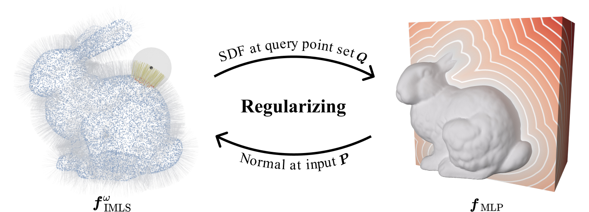

# Neural-IMLS

The official implementation of Neural-IMLS.

[Arxiv](https://arxiv.org/abs/2109.04398)  [PDF](https://ieeexplore.ieee.org/document/10146518)

## Introduction

This is the code for directly training neural implicit representations from unoriented noisy 3D point clouds.

It allows training, testing, and evaluate the tasks of surface reconstruction.

We provide the code for training and testing a new model on your own data. Besides, we provide some reconstruction results of our method.



### Requirements

Our codebase uses [PyTorch](https://pytorch.org/).

The code was tested with Python 3.7.9, torch 1.11.0, CUDA 11.3 on Ubuntu 18.04 (should work with later versions).

The most important part of the environment is [pytorch3d](https://github.com/facebookresearch/pytorch3d).

```python
conda env create -f imls.yml
```

### Training

To train the model to overfit one shape, run this command:

```bash
python train.py --pts_dir <path_to_data> --name <experiment_name>
```
For example:
```bash
python train.py --pts_dir data/ori_bunny.xyz.npy --name famous_ori_bunny --patch_radius 0.03 --points_per_patch_max 100
```

Here are some important parameters:

- --patch_radius, ball radius nearest neighbor (FRNN) for MLS, large patch radius brings the smoother results
- --points_per_patch_max, max number of points in a ball, collocation with patch radius
- --k, kth nearest neighbor for MLS, less than 0 means leverage FRNN otherwise KNN
- --loss, MLS Projection, or implicit MLS. Projection MLS is recommended for some thin structures and single-layer geometry, while implicit MLS is recommended for most cases.
  - Note that we found it should leverage KNN rather than FRNN for projection MLS.


### Test and Evaluation

To evaluate the model, run:

```bash
python test.py --model_path <path_to_trained_model> --name <experiment_name> --mesh_path <path_to_gt_mesh>
```

For example (may need to tune the parameter weight_norm=False in network/IDRNet.py with pre-trained models):
```bash
python test.py --model_path experiment/famous_noisefree_Armadillo/epoch_35.pth --name famous_noisefree_Armadillo --mesh_path mesh/Armadillo.obj
```

### Results

Our surface reconstruction results (meshes) on SRB (The Surface Reconstruction Benchmark from [DGP](https://github.com/fwilliams/deep-geometric-prior)) are available for download [here](https://www.dropbox.com/sh/v0265pnqiv9gctb/AACivNvhGjeXw3SEtYo06sOXa?dl=0).

Our surface reconstruction results (meshes) on ABC no.n, ABC var.n, FAMOUS no.n, FAMOUS med.n, FAMOUS sparse, FAMOUS
dense, Thingi10k no.n, Thingi10k med.n, Thingi10k sparse, Thingi10k dense (data preprocessed by [Points2Surf](https://github.com/ErlerPhilipp/points2surf)) are available for download [here](https://www.dropbox.com/sh/qzb7013o4a3yktl/AAB5yOY91h8MJban4JiHW1Iea?dl=0).

### Acknowledgment

We greatly appreciate @**[ErlerPhilipp](https://github.com/ErlerPhilipp)** for his selfless dedication to the code.

### Citation

If you use our work, please cite our paper:

```bibtex
@ARTICLE{neuralimls2023wang,
  author={Wang, Zixiong and Wang, Pengfei and Wang, Pengshuai and Dong, Qiujie and Gao, Junjie and Chen, Shuangmin and Xin, Shiqing and Tu, Changhe and Wang, Wenping},
  journal={IEEE Transactions on Visualization and Computer Graphics}, 
  title={Neural-IMLS: Self-supervised Implicit Moving Least-Squares Network for Surface Reconstruction}, 
  year={2023},
  volume={},
  number={},
  pages={1-16},
  doi={10.1109/TVCG.2023.3284233}
 }
```

